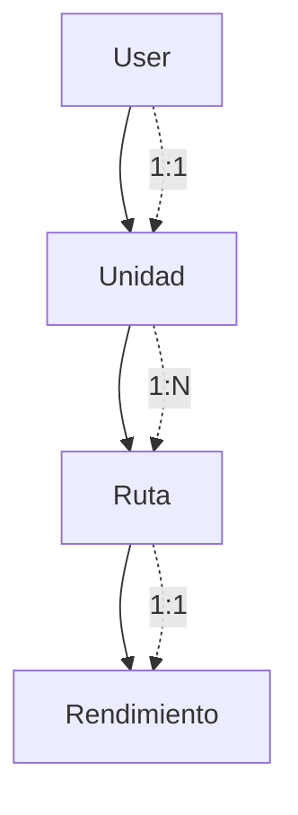

# Arquitectura del Sistema

## Decisiones de Diseño

### Arquitectura General
- Clean Architecture: Capas separadas (API → Service → Repository)
- Domain-Driven Design: Modulos de negocio autocontenidos
- Inyeccion de Dependencias: FastAPI Depends() para desacoplamiento

### Tecnologias Elegidas
- FastAPI: Framework moderno con documentacion automatica
- SQLModel: ORM hibrido (SQLAlchemy + Pydantic)
- SQLite: Base de datos simple para desarrollo
- Pydantic: Validacion automatica de tipos

### Patrones Implementados
- Repository Pattern: Abstraccion de acceso a datos
- Service Pattern: Logica de negocio y validaciones
- DTO Pattern: Schemas separados para request/response

## Estructura del Proyecto

```
backend-control-transportistas/
├── app/
│   ├── core/                 # Configuracion global
│   │   ├── config/settings.py    # Variables de entorno
│   │   └── db/                  # Configuracion BD
│   │       ├── base.py          # Modelo base
│   │       ├── config.py        # Inicializacion
│   │       └── session.py       # Sesiones DB
│   ├── features/             # Modulos de negocio
│   │   ├── users/           # Gestion de usuarios
│   │   ├── unidades/        # Gestion de unidades
│   │   ├── rutas/           # Gestion de rutas
│   │   └── rendimiento/     # Rendimiento de rutas
│   └── shared/              # Utilidades compartidas
├── main.py                  # Punto de entrada
├── requirements.txt         # Dependencias Python
├── test.db                 # Base de datos SQLite
└── README.md               # Instrucciones
```

### Patron por Modulo
Cada feature sigue estructura consistente:

```
feature/
├── models/         # Entidades BD (SQLModel)
├── schemas/        # DTOs (Pydantic)
├── repositories/   # Acceso a datos
├── services/       # Logica de negocio
└── api/           # Endpoints HTTP
    ├── routes.py      # Rutas FastAPI
    └── dependencies.py # Inyeccion dependencias
```

## Modelo de Datos



- Usuario → Unidad: Relacion 1:1 obligatoria
- Unidad → Ruta: Relacion 1:N (una unidad, multiples rutas)
- Ruta → Rendimiento: Relacion 1:1 (una ruta, un rendimiento)

## Decisiones Tecnicas Clave

### Base de Datos
- SQLite para desarrollo (setup simple)
- Auto-creacion de tablas al iniciar

### API Design
- RESTful con endpoints CRUD
- JSON para comunicacion
- HTTP status codes apropiados
- Paginacion en listados grandes
- Filtros por parametros query

### Seguridad y Validacion
- Password hashing con bcrypt
- CORS para integracion frontend
- Validaciones en multiples capas
- Type safety con Python hints

### Desarrollo
- Auto-reload en desarrollo
- Conventional commits para git
- Documentacion automatica (Swagger)
- Type hints en todo el codigo
